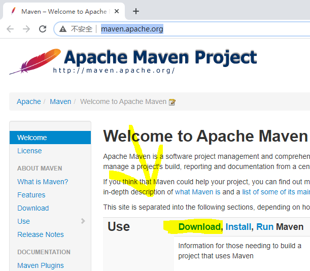
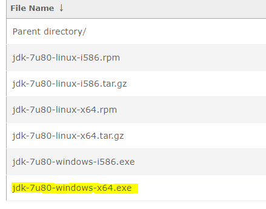

# Maven的安装步骤

## <补充>

    - 为了更快完成编译可以使用阿里巴巴镜像仓库，因为中央仓库是国外的下载速度较慢。

    - 编辑Maven>conf文件夹内的settings.xml文件
    
    在这行里添加
    <mirrors>
        <mirror>
        <id>aliyunmaven</id>
        <mirrorOf>*</mirrorOf>
        <name>阿里云公共仓库</name>
        <url>https://maven.aliyun.com/repository/public</url>
    </mirrors>

## （一）下载安装包与安装JDK

- Maven官网链接：http://maven.apache.org/

- jdk7下载链接：https://repo.huaweicloud.com/java/jdk/7u80-b15/

    Maven需要jdk7低版本才能避免报错

## （二）开始安装

### 1. 新建maven_work文件夹(可任意命名)
### 2. 解压安装包(apache-maven-3.6.3)到maven_work文件夹下

### 3. 配置环境变量
    
新增系统变量
    
    <变量名>>MAVEN_HOME
    <变量值>>*\apache-maven-3.6.3
    
    <变量名>>CLASSPATH
    <变量值>>.;%JAVA_HOME%\lib\dt.jar;%JAVA_HOME%\lib\tools.jar;

    <变量名>>JAVA_HOME
    <变量值>>C:\Program Files\Java\jdk1.7.0_80

    *号代表maven安装文件夹所在的文件路径

配置系统变量Path

    <变量名>>Path
    <变量值>>在开头新增下列几个变量
        %JAVA_HOME%\bin;
        %JAVA_HOME%\jre\bin;
        %MAVEN_HOME%\bin;

## （三）新建Hello项目

### 1. 项目约定的目录结构：
    <项目主目录>
    - Hello(文件夹)
    <项目Hello目录>
    - src(文件夹)
    - pom.xml(文件必须要有且要配置)
    <项目Hello>src目录>
    - main(文件夹)
    - test(文件夹)
    <项目Hello>src>main目录>
    - java(主程序java文件文件夹)
    - resources(配置文件文件夹)
    <项目Hello>src>test目录>
    - java(测试主程序java文件的文件夹)
    - resources(测试使用的配置文件文件夹)

项目结构树状图：

### 2. 新建与配置<pom.xml>文件

配置如下所示：
    
    <?xml version="1.0" encoding="UTF-8"?>

    <project xmlns="http://maven.apache.org/POM/4.0.0" xmlns:xsi="http://www.w3.org/2001/XMLSchema-instance"
    xsi:schemaLocation="http://maven.apache.org/POM/4.0.0 http://maven.apache.org/xsd/maven-4.0.0.xsd">
    <modelVersion>4.0.0</modelVersion>
    <groupId>com.dontselfish</groupId>
    <artifactId>ch01-maven</artifactId>
    <version>1.0-SNAPSHOT</version>
    </project>

之后保存即可。

### 3. 新建java类

新建文件夹(包)

    - com(com主包)>dontselfish(dontselfish子包)

新建java文件

    - 在com>dontselfish下新建HelloMaven.java文件
    
配置HelloMaven.java

    package com.dontselfish;
    public class HelloMaven {
    public int add (int n1,int n2){
        return n1+n2;
    }
    public static void main(String args[]){
        HelloMaven hello = new HelloMaven();
        int res = hello.add(10,20);
        System.out.println("10+20="+res);
    }
    }

之后保存即可

### 4.检查Maven安装

如下图所示：

就代表安装和配置成功。

### 5.编译HelloMaven.java文件

    - 使用命令行工具cd进入HelloMaven.java所在的目录
    
    - 使用命令mvn compile 开始进行编译

    - 直到最后提示Build Success并且没有提示ERROR就表示已经成功编译